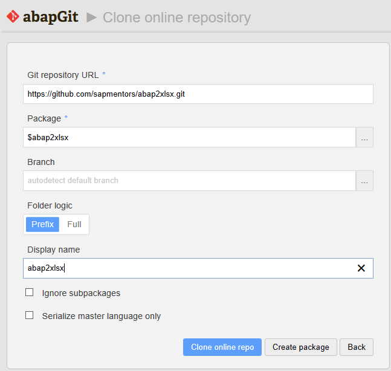

## Prerequisites

[Install abapGit](https://docs.abapgit.org/guide-install.html), if you have two factor authentication activated import https certificates from https://api.github.com ([Pull request #536](https://github.com/larshp/abapGit/pull/536))

## Procedure

Execute abapGit using the report **ZABAPGIT_STANDALONE**, click on *New Online*, fill the field *Git repository URL* with *https://github.com/abap2xlsx/abap2xlsx.git*, package with *$abap2xlsx* if you just want to test. If you want to transport abap2xlsx to production then use a non local package, for example ZABAP2XLSX. Click *Create package* if the package doesn't exist yet. Then click *Clone online repo*.

To install abap2xlsx click *pull*.

After installing, if you want to install the **demo programs**, repeat the actions above, starting from *New Online* to *pull*, and fill *Git repository URL* with *https://github.com/abap2xlsx/demos*. We recommend that you pick a local package name for the demos, for example $abap2xlsxdemos, since you most likely won't need them in a production system.

Be careful with the package name for demos: it should NOT be the basename of your abap2xlsx installation followed by "_demos"! If you have ZABAP2XLSX as base package, you may use ZABAP2XLSXDEMOS but not ZABAP2XLSX_DEMOS, for example. Quick background for the curious folks: before demos were spun off as a separate repository, they were placed in the "demos" subpackage of abap2xlsx and, yes, abapGit encodes the package / subpackage relationship with an underscore.
