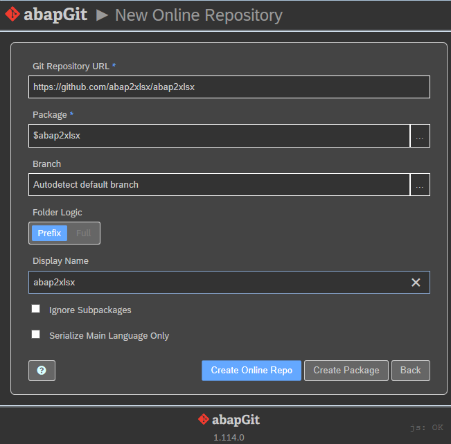

## Prerequisites

[Install abapGit](https://docs.abapgit.org/guide-install.html), if you have two factor authentication activated import https certificates from https://api.github.com ([Pull request #536](https://github.com/larshp/abapGit/pull/536))

## Procedure

Execute abapGit using the report **ZABAPGIT_FULL**, click on *New Online*, fill the field *Git repository URL* with *https://github.com/sapmentors/abap2xlsx.git*, package with *$abap2xls* if you just want to test. If you want to transport abap2xlsx to production then use a non local package. Click *Create package* if the package doesn't exist yet. Then click *Clone online repo*

To install abap2xlsx click *pull*.
